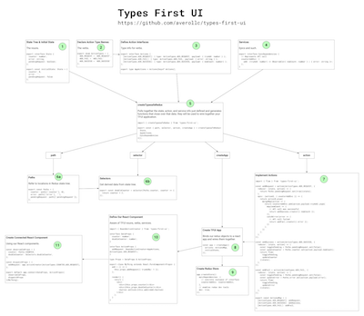

```
npm i types-first-ui
```

# Types-First UI

Types-First UI is an opinionated framework for building long-lived, maintainable UI codebases. It uses TypeScript and the power of its type system to guarantee the completeness and correctness of a Redux backend that can be connected to React components in a performant way. It places the focus on first defining your system in terms of the data and types that will drive it, then filling in the blanks. This project is inspired heavily by [re-frame](https://github.com/Day8/re-frame).

## Who is this for?

Well, first and foremost, it's for us at Avero. This library represents the codification and enforcement of what we have established as our best practices for building interfaces. However, we believe that there is significant value in this approach and that it is worth sharing.

Hopefully, there are others who can use and benefit from this work directly. But even if not, we think it is valuable to share our approach and give visibility into how one group of engineers chooses to approach some of the hard problems of building maintainable UI codebases.

More generally, this project might be for you if you believe...

- Types are important
- TypeScript is good
- Flat state tree -- all reducers have access to the entire tree
- Actions may have a reducer, an epic, both, or neither. M:N relationship between Actions => Redux primitives
- Epics (backed by redux-observable) as mechanism for side effects/middleware (vs. thunks or sagas)
- Observables are pretty dope

## **Philosophy**

Redux is an event dispatching system that operates on a single global state atom that is only modifiable via actions. It makes little sense to begin building your application before defining two interfaces: the shape of your state and the shape of all actions that operate on that state. From there we can leverage the strict unidirectional flow of Redux in our type system.

You should be familiar with the basic terminology of Redux (Actions, Reducers, Action Creators, Stores, Middleware) and RxJS (Observables, Epics) before reading further. The documentation for [Redux](https://redux.js.org/) and [Epics](https://redux-observable.js.org/docs/basics/Epics.html) are excellent, so we'd strongly encourage reading it.

This project aims to facilitate this "types-first" style of application design while providing utilities focused around maximizing type safety and maintaining interop with existing Redux libraries.

## **Anti-Pitch**

If you dislike types "getting in your way" or think of them as secondary to your application, then this is not the framework for you. At Avero we believe in starting with your API first, which in this case is the interfaces of your application.

If you do not care about the long-term maintainability of your codebase, such as writing a todo app or a school project, this may be overkill for you. This framework is designed and optimized for building large, production UI projects that will have a long lifespan and many contributors.

You will occasionally run into cryptic error messages (e.g. key inference on Paths) due to relying heavily on type inference. Deep lookup types + mapped types + conditional types + inference makes the compiler work pretty hard... which leads to the next point.

VS Code is a bit sluggish with this right now. You will not receive the instant 10ms feedback you may be used to, so there is a tradeoff here. Hopefully this will improve as the compiler matures around these newer type features. When I tried Webstorm it was not giving me the same level of inference as VS Code (Types-First UI requires TS 2.9+).

## Usage

Here's a diagram showing the following usage steps. Click to embiggen.

<a href="usage-diagram-lg.png?raw=true"></a>

Let's create a Redux counter application with Types-First UI. We will include basic pending/error handling and a mock API call to show slightly more complexity than the normal counter app.

```typescript
// 1. Create State Tree interface / initialState
export interface State {
  counter: number;
  error: string;
  pendingRequest: boolean;
};

export const initialState: State = {
  counter: 0,
  error: '',
  pendingRequest: false
};

// 2. Create ActionTypes enum
export enum ActionTypes = {
  ADD_REQUEST = 'ADD_REQUEST',
  ADD_FAIL = 'ADD_FAIL'
  ADD_SUCCESS = 'ADD_SUCCESS'
};

// 3. Create Action interfaces
export interface Actions {
  [ActionTypes.ADD_REQUEST]: { type: ActionTypes.ADD_REQUEST, payload: { tryAdd: number } };
  [ActionTypes.ADD_FAIL]: { type: ActionTypes.ADD_FAIL, payload: { error: string } };
  [ActionTypes.ADD_SUCCESS]: { type: ActionTypes.ADD_SUCCESS, payload: { newCount: number} };
};

export type AppActions = Actions[keyof Actions]; // creates Union type of actions that we will pass in to createTypesafeRedux
```

The first thing we want to do is define the interfaces of our application. The entire UI depends on state and action interfaces, so it makes sense to start with them first. Additionally, most maintenance work involves adding or modifying actions, so keeping them in one place is helpful for maintainability. Any changes to these interfaces should propagate down to the rest of the system. When we talk about "unidirectional" types, we are referring to these two interfaces driving downstream functions and utilities.

```typescript
// 4. Define any Epic Dependencies
export interface EpicDependencies {
  // Represents API call
  counterAddSvc: {
    add: (tryAdd: number) => Observable<{ newCount: number } | { error: string }>;
  };
}
```

Our Redux application has little knowledge of the outside world. Its focus is around actions and how those actions affect the state atom. We use [Epics](#epics) as a primitive for side effects, but the logic of those side effects should live behind "Services", which generically encapsulate any API that returns an observable. This is helpful for testing and separation of concerns.

```typescript
// 5. Pass our interfaces to createTypesafeRedux
import { createTypesafeRedux } from 'types-first-ui';

export const { path, selector, action, createApp } = createTypesafeRedux<
  State,
  AppActions,
  EpicDependencies
>();
```

Now we can use these interfaces to drive our typesafe "utility" functions. These are the functions you will use to build your Redux application. Any changes to the interfaces described above will be immediately reflected in these function signatures.

```typescript
// 6a. Create paths using the 'path' utility function from createTypesafeRedux
export const Paths = {
  counter: path(['counter'], 0),
  error: path(['error'], ''),
  pendingRequest: path(['pendingRequest']),
};

// 6b. Create selectors using 'selector' util function from createTypesafeRedux
export const doubleCounter = selector(Paths.counter, counter => {
  return counter * 2;
});
```

We now use the utility functions from `createTypesafeRedux` to create our [Paths](#path) and [Selectors](#selector). Generically, these represent observables of derived values from your state tree. Specifically, Paths are a directly referenceable property on your state tree; Selectors are derived values that are computed as a function of input Paths and Selectors.

Additionally, Paths include utility get, set, & unset functions that will be used in your reducers.

```typescript
import { flow } from 'types-first-ui';

// 7. Implement Actions: use 'action' util function from createTypesafeRedux
const addRequest = action(ActionTypes.ADD_REQUEST, {
  reducer: (state, action) => {
    // action inferred as {type: ActionTypes.ADD_REQUEST, payload: {tryAdd: number} }
    return Paths.pendingRequest.set(true)(state);
  },
  epic: (action$, { counterAddSvc }) => {
    return action$.pipe(
      mergeMap(action => {
        // action inferred as {type: ActionTypes.ADD_REQUEST, payload: {tryAdd: number} }
        return counterAddSvc.add(action.payload.tryAdd).pipe(
          map(newCount => {
            // API call was successful
            return addSuccess.creator({ newCount });
          }),
          catchError(error => {
            // API call failed
            return addFail.creator({ error });
          })
        );
      })
    );
  },
});

const addSuccess = action(ActionTypes.ADD_SUCCESS, {
  reducer: (state, action) => {
    const togglePending = Paths.pendingRequest.set(false);
    const updateCounter = Paths.counter.set(action.payload.newCount);
    return flow(
      togglePending,
      updateCounter
    )(state);
  },
});

const addFail = action(ActionTypes.ADD_FAIL, {
  reducer: (state, action) => {
    const togglePending = Paths.pendingRequest.set(false);
    const updateError = Paths.error.set(action.payload.error);
    return flow(
      togglePending,
      updateError
    )(state);
  },
});

export const ActionsMap = {
  [ActionTypes.ADD_REQUEST]: addRequest,
  [ActionTypes.ADD_SUCCESS]: addSuccess,
  [ActionTypes.ADD_FAIL]: addFail,
};
```

This is the primary focus of the developer when creating Redux applications. Given a set of actions and a state tree, we now need to implement the concrete instances of these actions.
This may include reducers, epics, both, or neither. The return type of `action` is an [ActionImplementation](#action-implementation). The exported ActionsMap represents an exhaustive collection of implementations for each action type that we defined in our initial interfaces. It will be passed into our `createApp` function below.

```typescript
// 8. Create the app instance
const app = createApp({
  actions: ActionsMap,
  initialState,
});

// 9. Initialize the app instance by creating & binding to a new redux store
app.createStore({
  epicDependencies: {
    // concrete instance of interface
    counterAddSvc: CounterAddSvc,
  },
  // enables redux dev tools
  dev: true,
});

export default app;
```

With our concrete instances, we can now create our app instance. This is used to bridge React and Redux--the app exposes a `connect` function that mirrors the Redux variation, except with support for our path and selector primitives. We use an explicit import of the app rather than a `Provider` component using React's context API.

```typescript
import { ActionCreator } from 'types-first-ui';
// helper utility to extract ActionCreator type given the discriminant
// useful to minimize boilerplate in ActionProps
type Creator<T extends ActionTypes> = ActionCreator<Extract<AppActions, { type: T }>>;

// 10. Define a React component with Types-First framework
interface DataProps {
  counter: number;
  doubleCounter: number;
}

interface ActionProps {
  addRequest: Creator<ActionTypes.ADD_REQUEST>;
}

type Props = DataProps & ActionProps;

export class CounterComponent extends React.PureComponent<Props> {
  add = () => {
    this.props.addRequest({ tryAddBy: 1 });
  };

  render() {
    return (
      <div>
        <div>{this.props.counter}</div>
        <div>{this.props.doubleCounter}</div>
        <button onClick={this.add}>Add</button>
      </div>
    );
  }
}

// 11. Connect your React component to the TFUI app
const observableProps = {
  counter: Paths.COUNTER,
  doubleCounter: Selectors.doubleCounter,
};

const dispatchProps = {
  addRequest: app.actionCreator(ActionTypes.COUNTER_ADD_REQUEST),
};

export default app.connect<DataProps, ActionProps>(
  observableProps,
  dispatchProps
)(CounterComponent);
```

## **Concepts**

### Selector

A selector is an observable representing some directly derivable value from your state atom. Selectors can be recursively combined to create other selectors. These are conceptually similar to [ngrx](https://github.com/ngrx/platform/blob/master/docs/store/selectors.md) selectors, as well as [reselect](https://github.com/reduxjs/reselect).

Selectors are closed over an observable of the state tree, and include a number of performance optimizations to guarantee that they will be shared, they will not leak subscriptions, they will emit at most once per change to the state tree, and they will only evaluate their projector function when their input values change. Selectors may optionally provide a comparator function to determine when new values should be emitted, for further performance optimizations. This is useful for selectors that return values which are not referentially equal (i.e. mapping over an array).

Selectors are created using the `selector` utility function.

```typescript
interface Todo {
  text: string;
  completed: boolean;
}

interface State {
  app: {
    todos: {
      [todoId: string]: Todo;
    };
  };
}

export const Paths = {
  TODOS: path(['app', 'todos']),
};

// Example selector usage--usually more than one input selector
export const completedTodos = selector(Paths.TODOS, todos => {
  return _.pickBy(todos, todo => {
    return todo.completed;
  });
});
// completedTodos is type Observable<[todoId: string]: Todo>

// selectors may also be parameterized
// Here is an example that returns a selector curried over a parameter
export const todoById = (id: string) => selector(Paths.TODOS, todos => todos[id]);
```

### Path

```typescript
export interface PathAPI<TState extends object, TVal> {
  get: (state: TState) => TVal;
  set: (nextVal: TVal) => (state: TState) => TState;
  unset: (state: TState) => TState;
}
export declare type Path<TState extends object, TVal> = Selector<TVal> &
  PathAPI<TState, TVal>;
```

A path is a selector with special properties and constraints. Paths represent observables of some subtree of your state atom. A path is constructed by providing the literal path to a subtree of your state interface. It is an observable that will emit whenever the focused piece of the state tree has changed (i.e. it is no longer referentially equal to its previous value). Paths are the primitive from which we compute other derived values, through selectors. For every subtree of your state tree, there should be a corresponding Paths object.

Because paths are bound directly to a piece of the state tree, they also include typesafe, non-mutating get, set, and unset functions which are used in our reducers.

Paths are created using the `path` utility function.

```typescript
// Example use of path
interface State {
  app: {
    counter: number;
    username: string;
    counterById: {
      [counterId: string]: number;
    };
  };
}

export const Paths = {
  COUNTER: path(['app', 'counter'], 0), // optional default argument,
  // Paths.COUNTER is type Observable<number> & { get: (State) => number, set: (number) => StateTransform<State>, unset: StateTransform<State> }
  USERNAME: path(['app', 'username'], ''),
  // Paths.USERNAME is type Observable<string> & { get: (State) => string, set: (string) => StateTransform<State> , unset: StateTransform<State>}
  BAD: path(['app', 'badPath']),
  // ERROR: argument of 'badPath' is not assignable to 'counter' | 'username'
};
```

### Action Implementation

```typescript
export interface ActionImplementation<
  TAction extends TAllActions,
  TState extends object,
  TAllActions extends Action,
  TEpicDependencies extends object
> {
  constant: TAction['type'];
  creator: ActionCreator<TAction>;
  reducer?: IReducer<TState, TAction>;
  epic?: SingleActionEpic<TAllActions, TAction, TEpicDependencies>;
}
```

This interface represents the "implementation" of a single action described in the system. It is the return type of the `action` function provided the framework. This provides strict type safety around your Redux primitives, as well as providing a useful grouping of tightly related code. The community has referred to this pattern as the [ducks](https://github.com/erikras/ducks-modular-redux) pattern. Action implementations are where we combine our typesafe utilities into meaningful business logic that will drive the functionality of our application.

Actions are implemented using the `action` utility function. When implementing an action you may provide a reducer or an epic for that action; you must exhaustively implement every action defined in your action types before you will be able to create an app instance.

```typescript
// the return value of the action utility is the full action implementation including
// a typesafe creator function and reference to the type constant
const addRequest = action(ActionTypes.ADD_REQUEST, {
  // reducers receive the full, flat state tree
  // type of action object is correctly inferred
  reducer: (state, action) => {
    // We use our path to return an update state tree
    return Paths.pendingRequest.set(true)(state);
  },
  // action epics are scoped to the specific action being implemented
  // notice there is no need to use ofType() here, because it is already
  // a stream of the ActionTypes.ADD_REQUEST action
  epic: (action$, { counterAddSvc }) => {
    return action$.pipe(
      // type of action object is correctly inferred
      mergeMap(action => {
        return counterAddSvc.add(action.payload.tryAdd).pipe(
          map(newCount => {
            // API call was successful
            return addSuccess.creator({ newCount });
          }),
          catchError(error => {
            // API call failed
            return addFail.creator({ error });
          })
        );
      })
    );
  },
});
```

### Epics

Types-First UI is built on top of redux-observable. We use epics as the primitive for managing asynchrony and side-effects within our system.

In general, epics meet the contract of actions in, actions out. For a full exploration of the concept, you should refer to the [redux observable guide](https://redux-observable.js.org/docs/basics/Epics.html). However, we also provide a set of more constrained, specific epic definitions: single-action epics, middleware.

```typescript
export declare type Epic<
  TWatchedAction extends Action,
  TReturnedAction extends Action,
  TEpicDependencies extends object
> = (
  action$: Observable<TWatchedAction>,
  deps: TEpicDependencies
) => Observable<TReturnedAction>;
```

#### Single-Action Epic

Single-action epics are provided as part of an action implementation. They are scoped to the specific action being implemented, and only have access to the stream of all actions emitted from the system as the third parameter. As a user, this means you do not have to use the `ofType()` operator within your action epics to narrow the action stream. This also guarantees that action implementations do not bleed concerns. Although most single action epics won't care about the allActions stream, it is useful for use cases such as cancellation.

```typescript
export declare type SingleActionEpic<
  TAllActions extends Action,
  TAction extends TAllActions,
  TEpicDependencies extends object
> = Epic<TAction, TAllActions, TEpicDependencies>;
```

```typescript
const addRequest = action(ActionTypes.ADD_REQUEST, {
  // action epics are scoped to the specific action being implemented
  // notice there is no need to use ofType() here, because it is already
  // a stream of the ActionTypes.ADD_REQUEST action
  epic: action$ => {
    return action$.pipe(
      // type of action object is correctly inferred
      map(action => {
        //...
      })
    );
  },
});
```

#### Middleware

Not to be confused with [Redux middleware](https://redux.js.org/advanced/middleware), this represents a particular type of "Epic"--one that never returns new actions. This is a good place to put "side effects" in your application (logging, tracing, setting context/storage, persistence, etc).

```typescript
export declare type MiddlewareEpic<
  TAllActions extends Action,
  TEpicDependencies extends object
> = Epic<TAllActions, never, TEpicDependencies>;
```

For example, we could have:

```typescript
import { empty } from 'rxjs';
import { tap, mergeMapTo } from 'rxjs/operators';

const logEverything: Middleware<AppActions, State, EpicDependencies> = actions$ => {
  return actions$.pipe(
    tap(console.log),
    mergeMapTo(empty())
  );
};
```

### App

App is the atomic unit of functionality in Types-First UI. Apps are recursively composable, which is cool...but scary and complicated. So I'm going to wait to document this feature.

## Foundational Technologies

- [TypeScript](https://github.com/Microsoft/TypeScript)
- [Redux](https://github.com/reactjs/redux)
- [RxJS](https://github.com/ReactiveX/rxjs)
- [Redux-Observable](https://redux-observable.js.org/)
